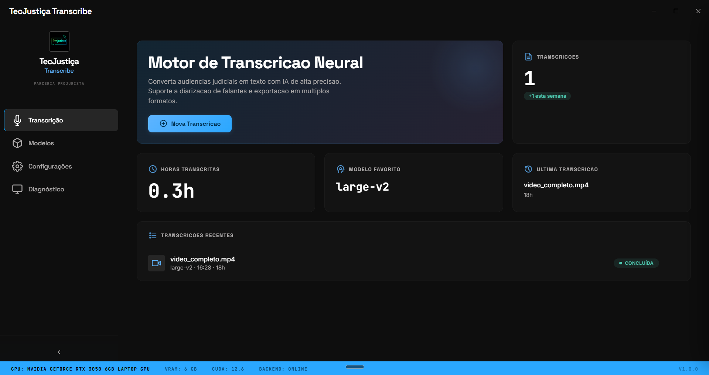

<div align="center">


# TecJustiça Transcribe

**Transcrição automática de audiências judiciais, com separação de falantes.**
Roda na sua máquina, com GPU NVIDIA, e funciona sem internet.

[](https://github.com/marcosmarf27/tecjustica-transcribe-desktop-releases/releases/latest)
[](https://github.com/marcosmarf27/tecjustica-transcribe-desktop-releases/releases/latest)
[](https://github.com/marcosmarf27/tecjustica-transcribe-desktop-releases/releases/latest)
[](https://opensource.org/licenses/MIT)

**[⬇ Baixar](https://github.com/marcosmarf27/tecjustica-transcribe-desktop-releases/releases/latest)** ·
**[🌐 Usar no navegador](https://audiencias.tecjustica.com/entrar)** ·
**[📖 Guia](https://transcricao-web.vercel.app/guia)**

</div>



---

## Sem instalar nada: a versão web

Se você não tem placa NVIDIA, ou usa o computador do fórum e não pode instalar
programas, abra a versão web. Você arrasta o vídeo da audiência no navegador e
recebe a transcrição pronta.

### 🌐 **[audiencias.tecjustica.com](https://audiencias.tecjustica.com/entrar)** — 40 horas de áudio por mês, de graça

O aplicativo desta página continua sendo a escolha certa para processo em
segredo de justiça: nele o áudio nunca sai da sua máquina.

| | Web | Este aplicativo |
|---|---|---|
| Instalação | nenhuma | instalador Windows ou Linux |
| Placa de vídeo | dispensa | NVIDIA recomendada |
| O áudio sai da máquina | sim, apagado em 30 dias | nunca |
| Limite de uso | 40 h por mês | nenhum |
| Preço | grátis | grátis |

---

## Instalação

### Windows (PowerShell)

```powershell
irm https://raw.githubusercontent.com/marcosmarf27/tecjustica-transcribe-desktop-releases/main/install.ps1 | iex
```

### Linux

```bash
curl -fsSL https://raw.githubusercontent.com/marcosmarf27/tecjustica-transcribe-desktop-releases/main/install.sh | bash
```

### Download manual

Baixe a versão mais recente na [página de releases](https://github.com/marcosmarf27/tecjustica-transcribe-desktop-releases/releases/latest).

- **Windows**: baixe o `.exe` e execute
- **Linux**: baixe o `.AppImage`, torne executável (`chmod +x`) e execute

---

## O que ele faz

| | |
|---|---|
| 🎙️ **Separa os falantes** | A diarização marca cada trecho por pessoa. Você clica no rótulo `SPEAKER_00`, digita "Juíza", e o nome vai junto para todas as exportações. |
| ▶️ **Texto colado no áudio** | Clique numa fala e o vídeo pula para aquele segundo. Deixe rolando e a transcrição acompanha, com a linha em destaque. |
| ✏️ **Correção na hora** | Dois cliques no segmento, corrige a palavra que o Whisper errou e salva. As exportações se atualizam. |
| 📄 **Exporta para os autos** | TXT, SRT, JSON e um relatório DOCX com capa, participantes, transcrição, análises e conversas. |
| 🤖 **Análise por IA (opcional)** | Resumo em tópicos com horário clicável, e chat com a transcrição. Você usa sua própria chave do Google Gemini ou da OpenAI. |
| 🔒 **Offline de verdade** | Depois da instalação, nenhum áudio sai da máquina e nada precisa de internet. |
| ⚡ **Fila de trabalhos** | Envie vários arquivos e continue usando o programa. A fila processa um por vez, para caber na VRAM. |

---

## Primeiro uso

O programa faz o setup sozinho na primeira abertura:

1. Instala o Python, se faltar
2. Instala o ffmpeg, se faltar
3. Cria o ambiente virtual com PyTorch e WhisperX (~3 GB de download)

### Pré-requisitos

- **GPU NVIDIA** (recomendada): driver 560 ou superior, para CUDA 12.6
- **Internet**: no primeiro uso, para o setup automático
- Sem GPU o programa funciona pela CPU, com transcrição mais lenta

---

## Modelos

O padrão é o `large-v3`, escolhido depois de comparar os três numa mesma
audiência. O `large-v2` trocou "admiti-la" por "demití-la", inversão de sentido
que numa ata muda o resultado. O `turbo` não compensou: no nosso pipeline o
tempo vai para a diarização e o alinhamento, e não para a transcrição.

---

<div align="center">

Software livre sob licença MIT.
Produto **TecJustiça**, em parceria com **Projurista**.

</div>
